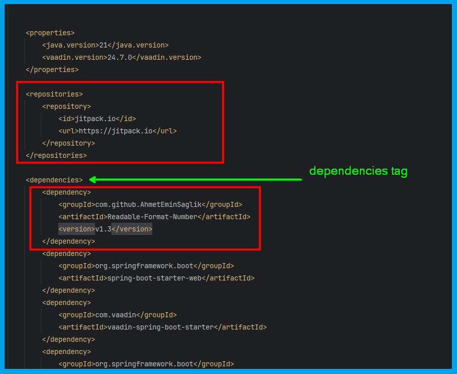

# Readable Format integer long value

This project is created to read better big digit numbers.
Let's give a short example.

### For integer

```
int num = 1234;
String text = ReadableFormat.getStringValue(num);
System.out.println(text);
```

And the output will be :

```
1_234
```

### For long

Another example of long variable :

```
long num2 = 123456789123L;
String text2 = ReadableFormat.getStringValue(num2);
System.out.println(text2);
```

And the output will be :

```
123_456_789_123
```

How to import library ?

1. Add following in your **pom.xml** file above **dependencies** tag:

```xml

<repositories>
    <repository>
        <id>jitpack.io</id>
        <url>https://jitpack.io</url>
    </repository>
</repositories>
```

2. Add following in your **pom.xml** in dependency :

```xml
<dependency>
    <groupId>com.github.AhmetEminSaglik</groupId>
    <artifactId>Readable-Format-Number</artifactId>
    <version>v1.3</version>
</dependency>
```
Example dependency add Screenshot:
 <br><br>